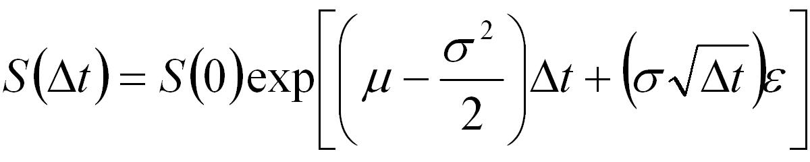

# Advanced Monte Carlo

This project is intended to showcase a relatively advanced Monte Carlo simulation implementation in VBA. It enables one to simulate underlying price movements for multiple stocks, accounting for a few basic complexities (skew, kurtosis, correlation, and nonstationarity) beyond a plain vanilla implementation to achieve more realistic and useful results. It is based upon this paper (https://papers.ssrn.com/sol3/papers.cfm?abstract_id=2665147), using the methods described therein and adding in nonstationarity optionality on top of that.

The above formula is the core of the stock price Monte Carlo simulation concept, modeling geometric Brownian motion under the risk-neutral measure. A simulated stock price can be conceptualized as the previous day's stock price multiplied by *e* to the sum of 1) some drift (scaled by time step *Δt*), and 2) a random walk (scaled by *√(Δt)*).

## Drift

An underlying's drift is simply a product of its *μ* (average simple return) and *σ* (simple return standard deviation) as calculated over some specified ex-post sample period, interacting as depicted in the formula above and then being scaled by *Δt*. Notably, the core of the drift term (that is, the part in the parentheses that's ultimately scaled by *Δt*) is also equivalent to the same ex-post sample's average log return, so it could just be defined as that directly without any need for *μ* or *σ*. Alternatively, *μ* and *σ* (or an expected average log return as previously explained) could be specified explictly to plug a particular ex-ante market view into the model.

## Random Walk

An underlying's random walk is simply *ε* (a random movement) scaled by both *σ* and *√(Δt)*.

## Extras

Importantly, this random term *ε* is ultimately the center of all attention. It is this term, for each underlying at each simulation step, that must be manipulated in careful and clever ways to account for nonnormality and correlation.

Specifically, there is at each step of the simulation with respect to the random term, *ε*:

1. The application of skew and kurtosis (ex-post sample or ex-ante desired) to each stock's simulated *ε* (achieving an *ε'* set)
2. The determination of necessary correlations by taking desired correlations (ex-post sample or ex-ante desired) and accounting for interactive effects (they must be made stronger to offset the correlation muting effect caused by applying skew and kurtosis in step 1)
3. The application of necessary correlations to the *ε'* set resulting from step 1 (achieving our final desired *ε''* set)

# Parameters

## Underlying Parameters

In addition to the most basic and fundamental parameters for this method (mean and variance), this Monte Carlo simulation implementation allows for the following inputs:

1. Skew
2. Kurtosis
3. Correlation
4. Nonstationarity (change in all other underlying parameters over time)

Nonstationarity can implemented as, say, a linear change in a value from A to B over the simulation period (the ex post parameter value should approach (A+B)/2). It can also be implemented in a more complex manner as desired, though expected values.

This allows for the very useful assessment of nuanced market views, (e.g. that a stock's returns variance will increase over the next year, or that two stocks' returns correlation will decrease).

Though it naturally slows down the simulation process in simple cases, say if mean returns or return correlations remain constant, this is intended to be a generic implementation that gives the user significant optionality. Where performance time is critical, an implementation tailored specifically for the task at hand with the precise amount of complexity necessary could be written. Moreover, a low-level language much better suited for such a task, such as C++, would likely be in order.

## Simulation Parameters

In addition to those parameters associated with the underlyings, there are the following inputs at the simulation level:

1. Time unit size = *Δt* (in trading days; e.g., days (1), weeks (5 trading days), months (21 trading days), etc.)
2. Time units (e.g., 252 if your simulation unit size is days (1) and you want to simulate prices over the course of a year)
3. Runs

While this implementation will accept and properly handle *Δt* assignments under 1 (e.g., half-days (0.5), quarter-days (0.25), etc.), it is worth mentioning that simulation results will not be as reliable even if considered just theoretically.

For *Δt* = 1, the impact from overnight price jumps is clearly assigned; each day's price change implicitly includes the night before's overnight price jump. For *Δt* > 1 (say *Δt* = 2 specifically), this too is handled satisfactorily; each jump includes day 0->1's overnight jump, day 1's session change, day 1->2's overnight jump, and day 2's session change. All price change components are included to encompass a slightly less smooth simulation in 2-day increments, with each simulation step being handled identically.

For *Δt* < 1 however (say *Δt* = 0.5 specifically), each half-day is assigned the impact of a half-overnight price jump, which is clearly nonsensical. If working with half-days it ought to be that odd simulation steps account for the preluding overnight price jump and the 1st half of the day's trading session, whereas even simulation steps account only for the 2nd half of the day's trading session. However, doing this would involve simulation steps no longer being handled identically, which violates the basic premise of our specified model.

# Limitations

Though relatively advanced, this Monte Carlo specification does not account for everything. Specifically, it does not capture the empirical reality of volatility clustering, as could be done using a GARCH model. Nor does it does not accurately capture the differentiated behavior between open-market and after-hours periods, as would a jump-diffusion model.

The primary impact of these limitations is that for underlyings whose precise movements (and especially volatilities) in the very near term are of critical importance to identify, this specification will leave much to be desired. An easy example of such a scenario would be an underlying we're looking at because we're considering purchasing a call option on it that expires in a week.

For most use cases however, where the duration of going concern for a portfolio of underlyings is over the medium to long term, this specification should prove quite appropriate and satisfactory. Although not from state of the art, it gets us to a pretty good model and covers all of the low-hanging fruit, so to speak.
